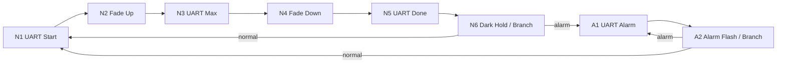

# 软件架构

## 当前默认 APP_PHASE=7

```text
main.c
  -> mx_system_init()          CubeMX2 系统与外设配置
  -> app_run()
       -> dma_graph_build     LUT 校验、8 个静态完整节点、两个 Q
       -> dma_graph_start     USART DMAT、LPDMA1_CH0、TIM2 UDE/PWM
       -> bsp_button          TIM6 40 ms 单脉冲、PC13 EXTI
       -> HAL_SuspendTick     关闭 SysTick 中断并清 pending
       -> WFI                 无 CPU 周期调度

EXTI13_IRQHandler (generated)
  -> HAL_EXTI_IRQHandler
  -> bsp_button callback      读取 TIM6 CEN、重启消抖窗口
  -> mode_button_event       通过消抖才翻转期望模式
  -> dma_graph_request_mode  只写 N6/A2 SRAM CLLR
```

根 CMake 扩展添加 App/BSP/Drivers_App 源文件与 Config include 路径。生成器代码、HAL、LL 未修改。
`bsp_vcp` 阻塞串口和 `bringup_dma` 只用于早期阶段；最终四类日志来自 DMA 引用的不可变 Flash 字符串。

## 单通道硬件执行图



单个 LPDMA channel 负责全部节点；TIM2 独立产生 PWM，DMA 改 CCR1；UART/TIM request 在静态节点边界切换。
App 管理初始化、期望模式和 WFI。dma_graph 管理描述符、唯一通道、启动与安全点改链。
pwm_waveform 提供 LUT；logger_dma 提供固定日志 buffer。CPU 不逐节点调度。

Runtime Relinking 已实现并经过有限上板验证；RM0522 的并发取链规则仍待核查。只修改预定 SRAM 分支 link，不在 ISR 中调用一般 Q 插入/删除，不为切换 stop/restart DMA。
`desired_mode` 表示期望；硬件可能已经装载旧 link，不承诺立即切换，也不把期望值作为已进入模式的证据。

V1 先用普通 Sleep/WFI；LPDMA 名称不代表 TIM2/USART2 在 Stop 等深度睡眠模式下一定工作。

## 所有权、中断与错误

LPDMA1_CH0 复用生成的 TIM2 DMA handle，统一归 dma_graph 管理。混合图不调用 HAL_TIM_Start_DMA / HAL_UART_Transmit_DMA；生成器中的 LPDMA2_CH0 仅为早期 Direct DMA 验证保留，最终不启动。
HAL_Q 只用于启动前建图；运行时改链后 Q 的拓扑元数据不再反映跨环关系，不在运行中用 Q API 遍历、删除或停止图。

| 来源 | 最终配置 |
| --- | --- |
| EXTI13 | 按键触发，短回调处理消抖与两次 link 写入 |
| LPDMA1_CH0 | 仅 DTE/ULE/USE 错误 IRQ |
| TIM2、TIM6 | NVIC 关闭；TIM2 UDE 开启，TIM6 无 IRQ/DMA |
| USART2、LPDMA2_CH0 | NVIC 关闭 |
| SysTick | TICKINT 关闭 |

`app_diagnostics.c` 用 GNU 链接器 wrapper 识别 UART/TIM/DMA 初始化错误；在 HAL_DMA_IRQHandler 前记录首个 DMA 错误的 CSR/CCR/CTR1/CTR2/CBR1/CSAR/CDAR/CLLR，避免 HAL 复位通道后丢失现场。错误 callback 记录 HAL error codes，再进入 app_fault。wrapper 不增加稳态周期工作。
错误停止保存上下文、关闭可屏蔽中断并 WFI；没有自动恢复策略。故障后应复位，不能用调试器直接越过故障函数继续演示。
