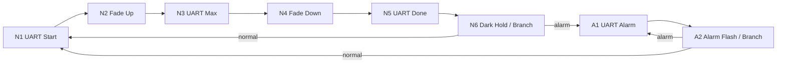

# 软件架构

## 当前 P1

```text
main.c
  -> mx_system_init()          CubeMX2 系统与外设配置
  -> app_run()                固定档位验证
       -> bsp_led             TIM2_CH1 固定 PWM，分别启动 channel 和 counter
       -> bsp_vcp             主循环中发送带超时的 P1 日志
       -> bsp_button          注册/使能 PC13 EXTI，时间戳消抖
       -> 空闲 WFI            P1 保留 SysTick

EXTI13_IRQHandler (generated)
  -> HAL_EXTI_IRQHandler
  -> bsp_button callback
  -> 应用事件计数
```

根 CMake 扩展添加 App/BSP 源文件与 Config include 路径。生成器代码、HAL、LL 未修改。
没有 CPU 周期动画；P1 只在启动和用户事件时选择固定 duty。

## 最终目标（尚未实现）



单个 LPDMA channel 负责全部节点；TIM2 独立产生 PWM，DMA 改 CCR1；UART/TIM request 在静态节点边界切换。
App 管理初始化、期望模式和 WFI。dma_graph 管理描述符、唯一通道、启动与安全点改链。
pwm_waveform 提供 LUT；logger_dma 提供固定日志 buffer。CPU 不逐节点调度。

Runtime Relinking 设计待 RM0522 核查与 P4/P6 硬件验收。只修改预定 SRAM 分支 link，不在 ISR 中调用一般 Q 插入/删除，不为切换 stop/restart DMA。
`desired_mode` 表示期望；硬件可能已经装载旧 link，不承诺立即切换，也不把期望值作为已进入模式的证据。

V1 先用普通 Sleep/WFI；LPDMA 名称不代表 TIM2/USART2 在 Stop 等深度睡眠模式下一定工作。
